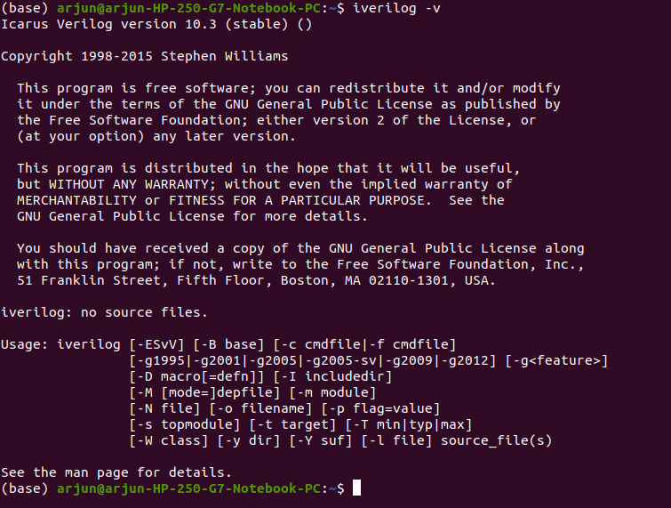
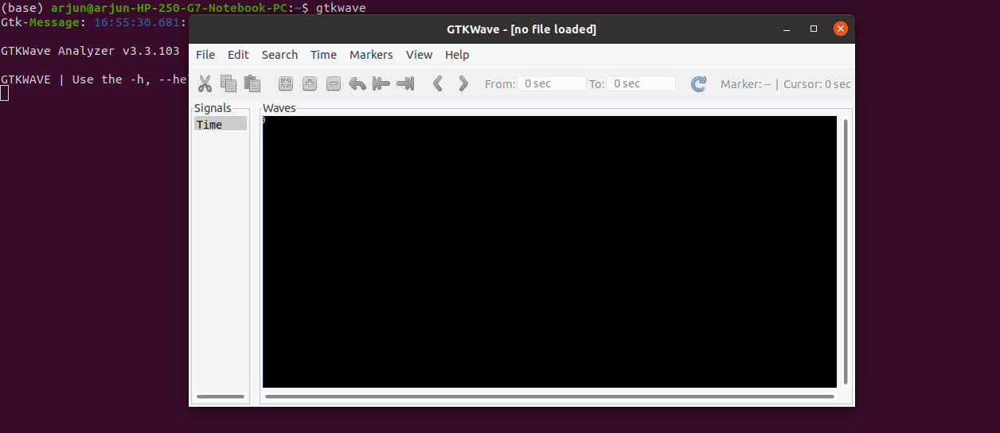
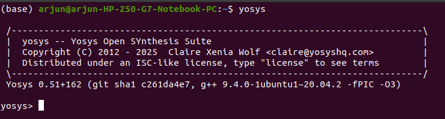
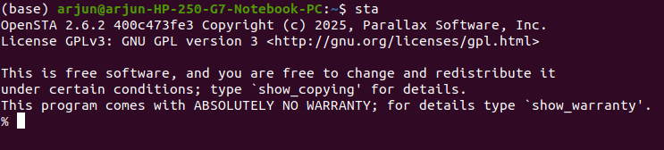
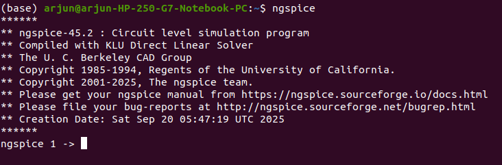
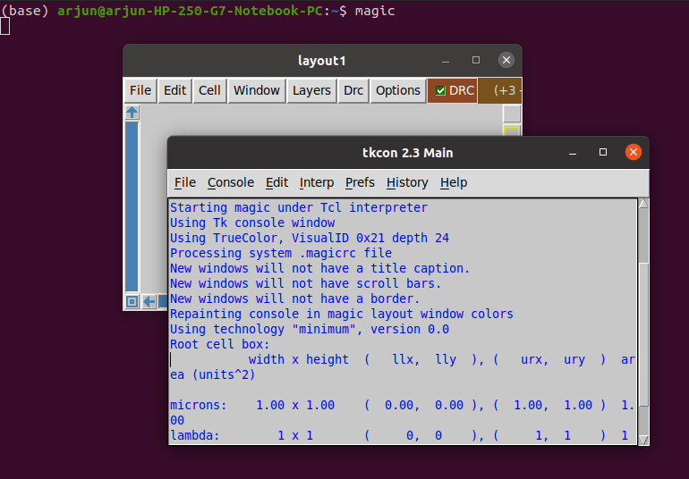

# RISC-V SoC Tapeout Program - RTL-to-GDS
---
## Week 0: System Setup and Tools Installation

### *System Requirements*
#### For Widows User
- 6 GB RAM, 50 GB HDD
- Ubuntu 20.04 or higher
- 4 vCPU
- Install VirtualBox

  **Virtual Machine Link:**
  [Oracle VM](https://www.virtualbox.org/wiki/Downloads)

#### For Linux (Ubuntu) User
- Directly start with installing the opensource tools
---

### *Tools installation*
#### Install iverilog
```bash
   $ sudo apt-get update
   $ sudo apt-get install iverilog
   $ iverilog -v
```
<p align="center">
  
</p>

#### Install gtkwave
```bash
   $ sudo apt-get update
   $ sudo apt install gtkwave
   $ gtkwave
```
<p align="center">
  
</p>

#### Install yosys
```bash
   $ sudo apt install make  ## if make is already installed then skip this command
   $ sudo apt-get update
   $ git clone https://github.com/YosysHQ/yosys.git
   $ cd yosys
   $ sudo apt-get install build-essential clang bison flex \
     libreadline-dev gawk tcl-dev libffi-dev git \
     graphviz xdot pkg-config python3 libboost-system-dev \
     libboost-python-dev libboost-filesystem-dev zlib1g-dev
   $ make config-gcc
   $ make
   $ sudo make install
   $ yosys
```
<p align="center">
  
</p>


#### Install OpenSTA
Follow this link for complete procedure to install OpenSTA 

[https://github.com/The-OpenROAD-Project/OpenSTA](https://github.com/The-OpenROAD-Project/OpenSTA)
```bash
   $ sta  ## this will run opensta in terminal
```
<p align="center">
  
</p>

#### Install ngspice
Download Tarball from [https://sourceforge.net/projects/ngspice/files/](https://sourceforge.net/projects/ngspice/files/).

```bash
   $ tar -zxvf ngspice-45.2.tar.gz
   $ cd ngspice-45.2/
   $ mkdir release
   $ cd release
   $ ../configure  --with-x --with-readline=yes --disable-debug

   ## not found xaw library
   $ sudo apt install libxaw7-dev libx11-dev libxext-dev libreadline-dev
   ## run again
   $ ../configure  --with-x --with-readline=yes --disable-debug

   $ ../configure --with-x --with-readline=yes --disable-debug --prefix=/usr/local
   $ make
   $ sudo make install
   $ ngspice
```
<p align="center">
  
</p>

#### Install magic
```bash
   ## install dependencies
   $ sudo apt-get install m4
   $ sudo apt-get install tcsh
   $ sudo apt-get install csh
   $ sudo apt-get install libx11-dev
   $ sudo apt-get install tcl-dev tk-dev
   $ sudo apt-get install libcairo2-dev
   $ sudo apt-get install mesa-common-dev libglu1-mesa-dev
   $ sudo apt-get install libncurses-dev e

   ## install magic
   $ git clone https://github.com/RTimothyEdwards/magic
   $ cd magic
   $ ./configure
   $ make
   $ make install
   $ magic

```
<p align="center">
  
</p>


## Tools Installed
- Iverilog : Done
- gtkwave  : Done
- OpenSTA  : Done
- yosys    : Done
- magic    : Done
- ngspice  : Done
